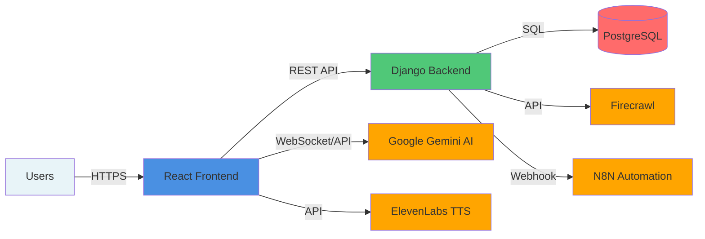
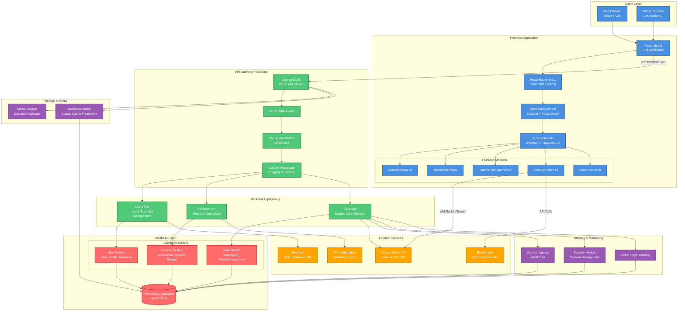
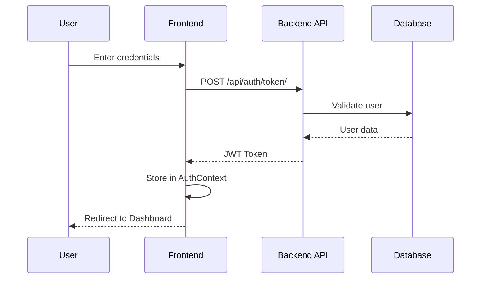
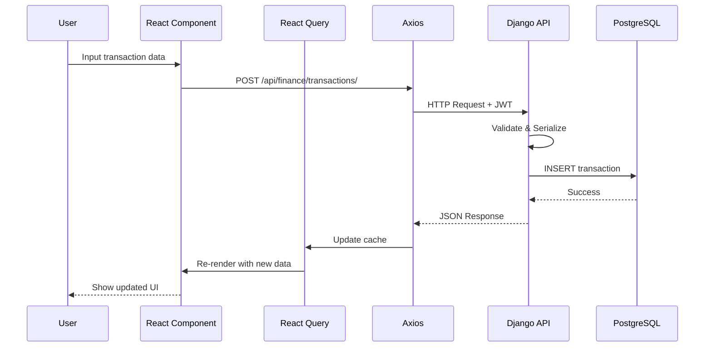
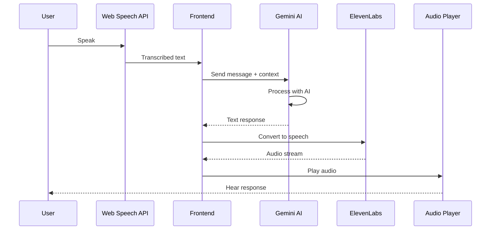

# Finance Growth Co-pilot - System Architecture

## High-Level Architecture Overview

## Detailed System Architecture Diagram

## Component Details

### Frontend Architecture

#### Core Technologies
- **React 18.2.0**: UI framework
- **Vite 7.2.2**: Build tool and dev server
- **React Router 6.8.1**: Client-side routing
- **TanStack Query 4.42.0**: Server state management
- **Zustand 5.0.8**: Client state management
- **Axios 1.13.2**: HTTP client

#### Key Pages & Components
- **Authentication**: Login, Register, Registration Status
- **Dashboards**: 
  - Super Admin Dashboard
  - Business Admin Dashboard
  - User Dashboard
- **Finance Modules**: Transactions, Invoices, Cash Flow, Credit, Suppliers
- **Voice Assistant**: KAVI voice interface
- **Admin Panel**: User Management, Security, Analytics

### Backend Architecture

#### Core Technologies
- **Django 5.2.6**: Web framework
- **Django REST Framework 3.16.1**: API framework
- **PostgreSQL**: Primary database (Neon Cloud)
- **JWT Authentication**: Token-based auth
- **Python 3.10+**: Runtime

#### Application Modules

**1. Users App** (`backend/users/`)
- User authentication & registration
- Business management
- User profiles & roles
- Team management (Memberships, Invitations)
- Business registration workflow

**2. Finance App** (`backend/finance/`)
- Transaction management
- Invoice creation & tracking
- Budget planning
- Cash flow analysis & forecasting
- Credit score calculation
- Supplier management

**3. Core App** (`backend/core/`)
- Activity logging & audit trails
- Security monitoring
- Module assignment system
- Session management
- Failed login tracking

### Database Schema

#### User Models
- `User` (Django built-in)
- `UserProfile` - Extended user information
- `Business` - Business entity
- `Membership` - User-Business relationships
- `BusinessInvitation` - Team invitations
- `BusinessRegistration` - Registration applications
- `Customer` - Client management

#### Finance Models
- `Transaction` - Financial transactions
- `Invoice` - Customer invoices
- `InvoiceItem` - Invoice line items
- `Budget` - Budget planning
- `CashFlow` - Cash flow analysis
- `FinancialForecast` - AI-powered forecasts
- `CreditScore` - Credit assessment
- `Supplier` - Supplier management

#### Core Models
- `ActivityLog` - System activity tracking
- `UserSession` - Active session management
- `FailedLoginAttempt` - Security monitoring
- `ModuleAssignment` - Feature access control

### External Integrations

#### AI Services
- **Google Gemini AI**: Voice conversations, chat, financial analysis
- **ElevenLabs**: Premium text-to-speech for voice assistant

#### Automation & Intelligence
- **Firecrawl**: Web intelligence for business classification
- **N8N**: Workflow automation (M-Pesa reconciliation, invoice reminders)

### Security Features

1. **Authentication**
   - JWT token-based authentication
   - Token refresh mechanism
   - Role-based access control (RBAC)

2. **Authorization**
   - Super Admin role
   - Business Admin role
   - Staff/Viewer roles
   - Route guards for protected pages

3. **Monitoring**
   - Activity logging for all system actions
   - Failed login attempt tracking
   - Session management & termination
   - IP address & user agent tracking

4. **Data Protection**
   - CORS configuration
   - CSRF protection
   - Secure password validation
   - Database-level security

### Data Flow Diagrams

#### Authentication Flow

#### Financial Data Flow

#### Voice Assistant Flow

### Deployment Architecture

#### Frontend
- **Build**: Vite production build
- **Hosting**: Static file hosting (Vercel/Netlify/Render)
- **Port**: 5173 (dev), 80/443 (production)

#### Backend
- **Server**: Django WSGI/ASGI
- **Hosting**: Render/Railway/Fly.io
- **Database**: Neon PostgreSQL (cloud)
- **Media**: Local storage or cloud storage (S3)

### Performance Optimizations

1. **Frontend**
   - Code splitting with React Router
   - React Query caching
   - Lazy loading components
   - Optimized bundle size

2. **Backend**
   - Database query optimization (indexes)
   - Database caching layer
   - API response pagination
   - Connection pooling

3. **Database**
   - Indexed fields for common queries
   - Efficient foreign key relationships
   - JSON field usage for flexible data

### Scalability Considerations

- **Horizontal Scaling**: Stateless API design
- **Database**: PostgreSQL connection pooling
- **Caching**: Database-backed cache for session data
- **CDN**: Static asset delivery
- **Load Balancing**: Multiple backend instances

## Technology Stack Summary

| Layer | Technology |
|-------|-----------|
| Frontend Framework | React 18.2.0 |
| Build Tool | Vite 7.2.2 |
| Routing | React Router 6.8.1 |
| State Management | Zustand + TanStack Query |
| UI Library | shadcn/ui + TailwindCSS |
| Backend Framework | Django 5.2.6 |
| API Framework | Django REST Framework |
| Database | PostgreSQL (Neon) |
| Authentication | JWT (SimpleJWT) |
| AI Services | Google Gemini, ElevenLabs |
| Automation | N8N |
| Web Intelligence | Firecrawl |

